# Indirect-ZNE DATA

The indirect-control paradigm offers a scalable approach to quantum computation by restricting external operations to a small subset of qubits, whereas the entire system evolves under its intrinsic manybody Hamiltonian. This framework reduces hardware complexity and limits the noise introduced through control channels. Recently, Anan et al. proposed an implementation of the variational quantum eigensolver (VQE) within this indirect-control architecture. However, the impact and integration of quantum error mitigation techniques in such a setting remain largely unexplored. In particular, zero-noise extrapolation (ZNE), a widely used error mitigation strategy, has not yet been systematically adapted to indirect-control VQE. A key requirement of ZNE is the controlled amplification of noise, which is commonly achieved through circuit-level techniques such as unitary folding. In the indirect-control framework, however, quantum operations are largely governed by continuous time-evolution under the system Hamiltonian, making the construction of physically realizable inverse operations non-trivial. In this study, we investigate the feasibility of implementing ZNE within the indirect-control VQE framework. We address the challenges associated with noise amplification in the presence of time-evolution operators and, with a minimal relaxation of the indirect-control constraint, propose a ZNE-based error-mitigation strategy that exploits the symmetry of the one-dimensional XY spin chain.

# Source Code Repository

Simulation source code can be found here (Note that the code requires some setup before it can be executed:):

[GitHub indirect-zne (dev branch)](https://github.com/arijit-ship/indirect-zne/tree/dev/src)

# Figures

| Figure | Link |
| --- | --- |
| 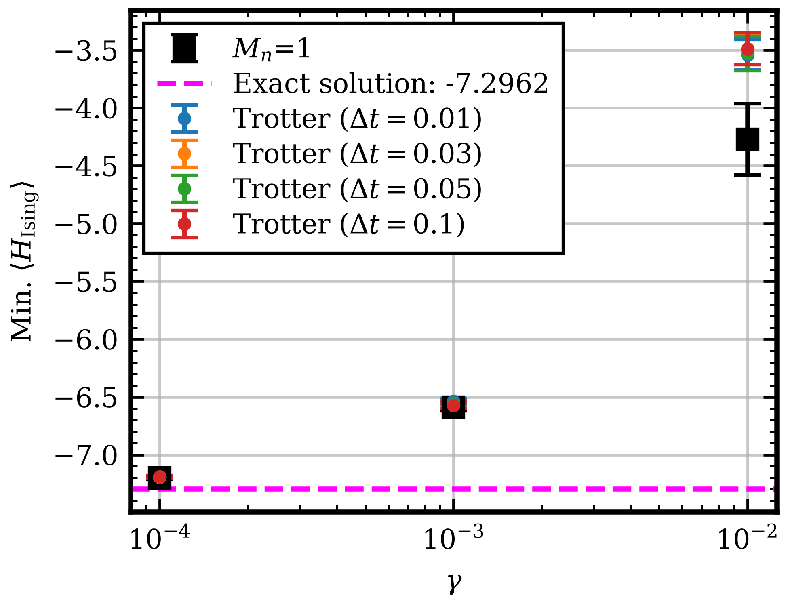 | [Jupyter Notebook](experiments/recent/REVIEW-SIMULATIONS/6Q-trotter.ipynb), [JSON Data][experiments/recent/REVIEW-SIMULATIONS/data/6Q-trotter]|
|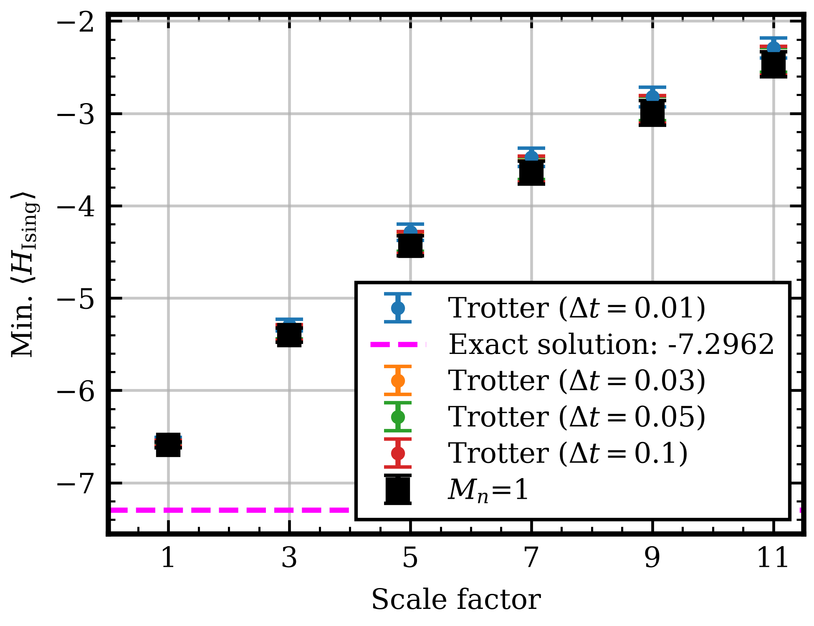| [Jupyter Notebook](experiments/recent/REVIEW-SIMULATIONS/6Q-trotter.ipynb), [JSON Data][experiments/recent/REVIEW-SIMULATIONS/data/6Q-trotter]|
|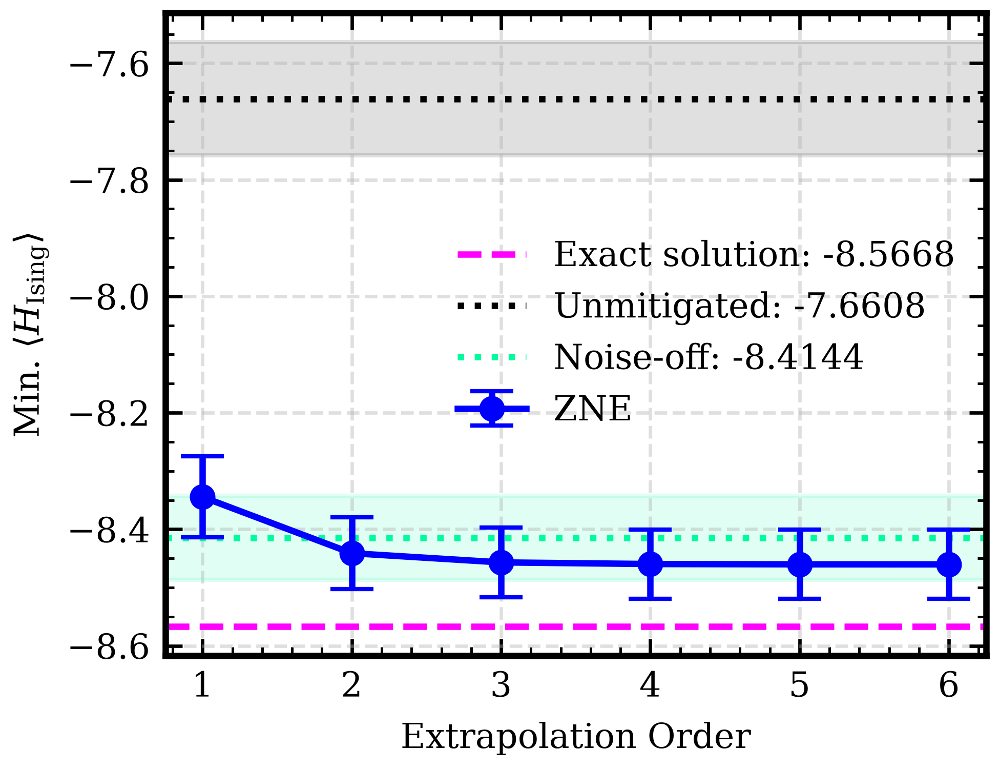|[Jupyter Notebook](experiments/recent/REVIEW-SIMULATIONS/7Q-various-tmax.ipynb), [JSON Data](experiments/recent/REVIEW-SIMULATIONS/data/7Q-various-tmax/7Q_tmax_sweep_ising_depol_tmax20_20260725_110811)|
|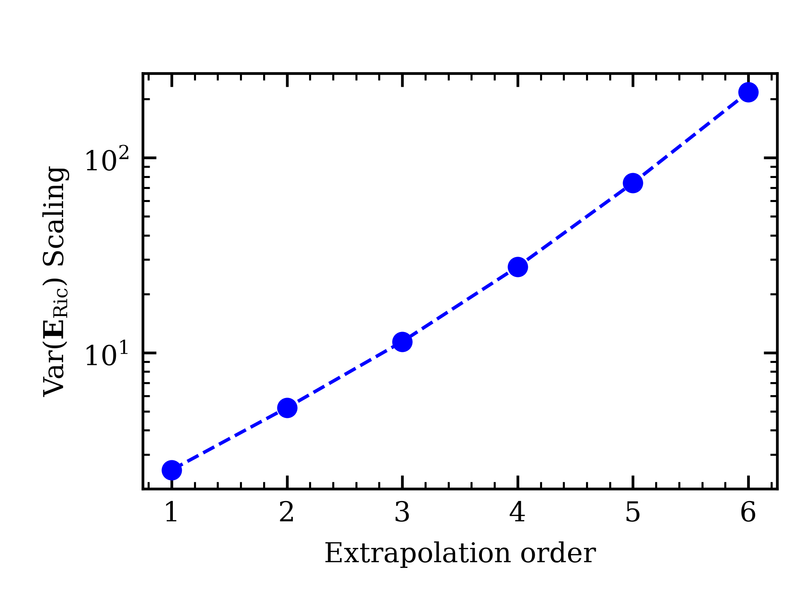|[Jupyter Notebook](experiments/recent/REVIEW-SIMULATIONS/7Q-various-tmax.ipynb), [JSON Data](experiments/recent/REVIEW-SIMULATIONS/data/7Q-various-tmax/7Q_tmax_sweep_ising_depol_tmax20_20260725_110811)|
|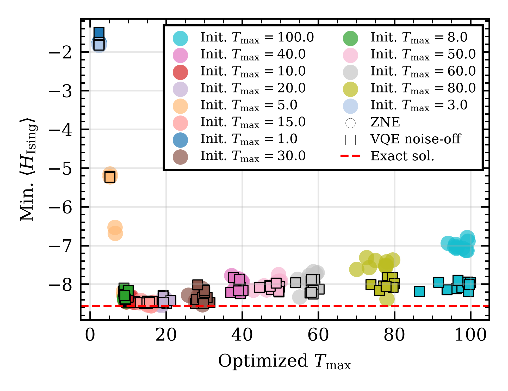|[Jupyter Notebook](experiments/recent/REVIEW-SIMULATIONS/7Q-various-tmax.ipynb), [JSON Data](experiments/recent/REVIEW-SIMULATIONS/data/7Q-various-tmax)|
|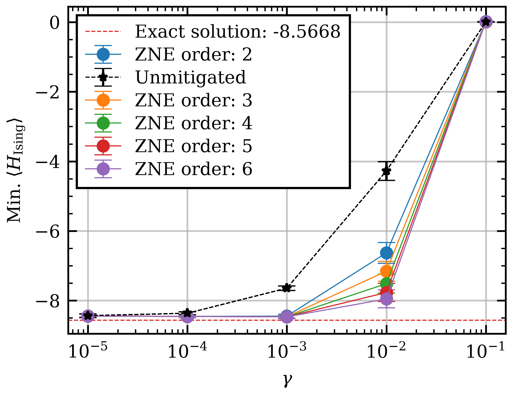|[Jupyter Notebook](experiments/recent/REVIEW-SIMULATIONS/7Q-various-gamma.ipynb), [JSON Data](experiments/recent/REVIEW-SIMULATIONS/data/7Q-various-gamma)|
|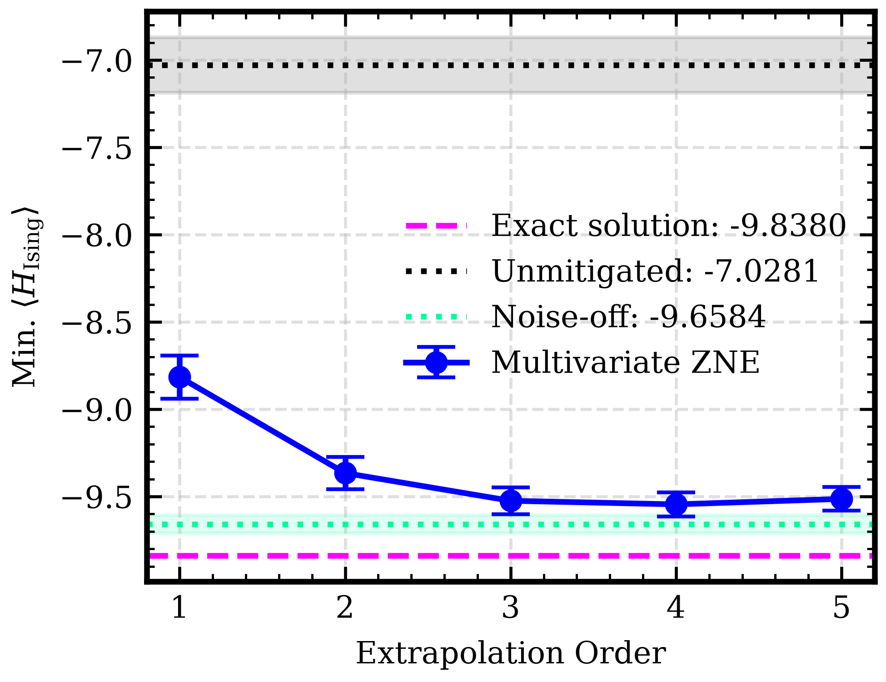|[Jupyter Notebook](experiments/recent/REVIEW-SIMULATIONS/8Q-ising-depol.ipynb), [JSON Data](experiments/recent/REVIEW-SIMULATIONS/data/8Q-ising-depol)|
|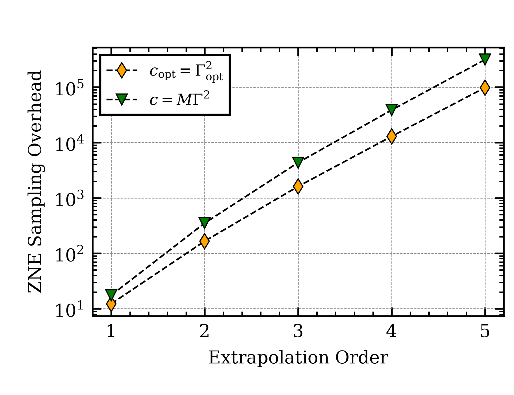|[Jupyter Notebook](experiments/recent/REVIEW-SIMULATIONS/8Q-ising-depol.ipynb), [JSON Data](experiments/recent/REVIEW-SIMULATIONS/data/8Q-ising-depol)|
|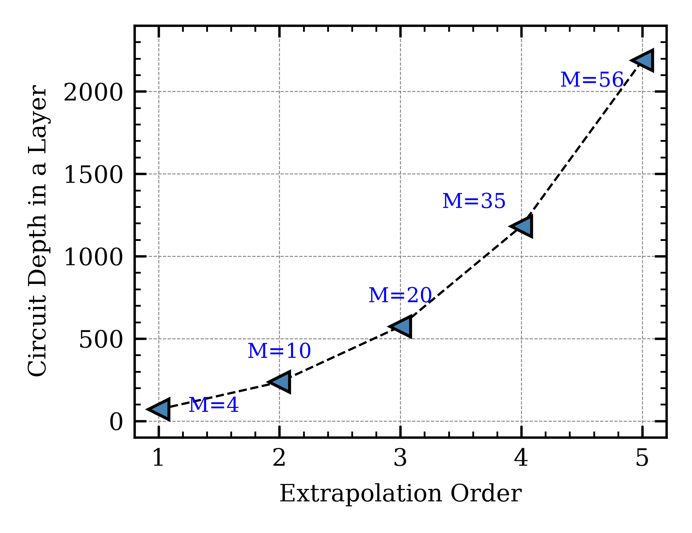|[Jupyter Notebook](experiments/recent/REVIEW-SIMULATIONS/8Q-ising-depol.ipynb), [JSON Data](experiments/recent/REVIEW-SIMULATIONS/data/8Q-ising-depol)|
|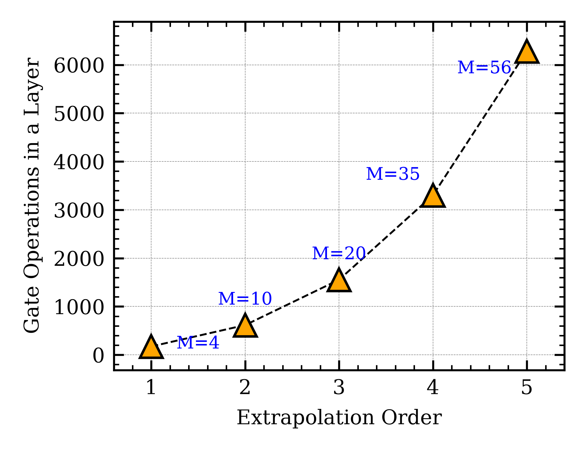|[Jupyter Notebook](experiments/recent/REVIEW-SIMULATIONS/8Q-ising-depol.ipynb), [JSON Data](experiments/recent/REVIEW-SIMULATIONS/data/8Q-ising-depol)|
|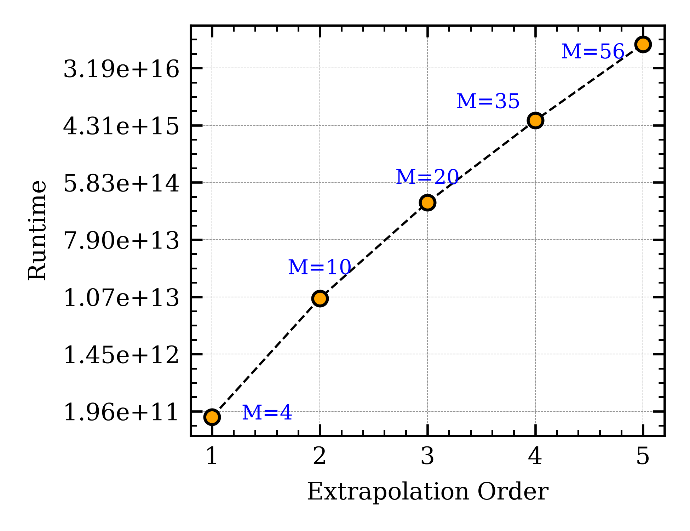|[Jupyter Notebook](experiments/recent/REVIEW-SIMULATIONS/8Q-ising-depol.ipynb), [JSON Data](experiments/recent/REVIEW-SIMULATIONS/data/8Q-ising-depol)|